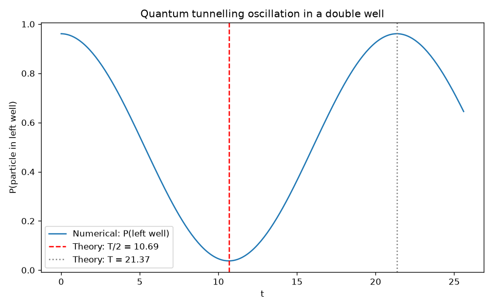
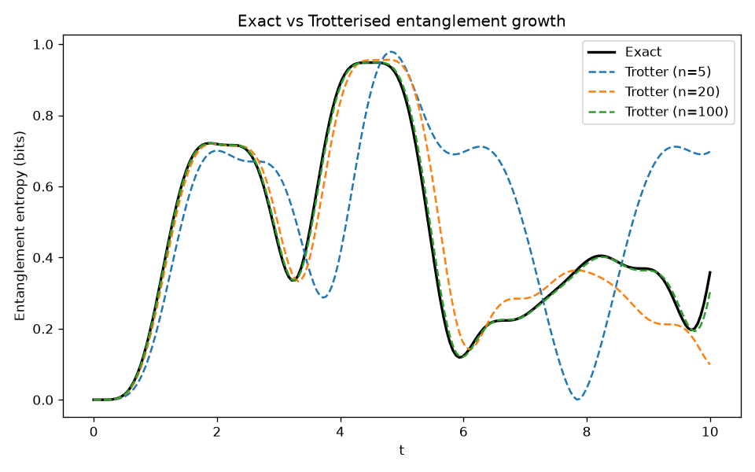
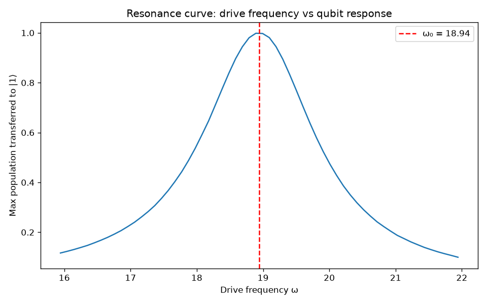
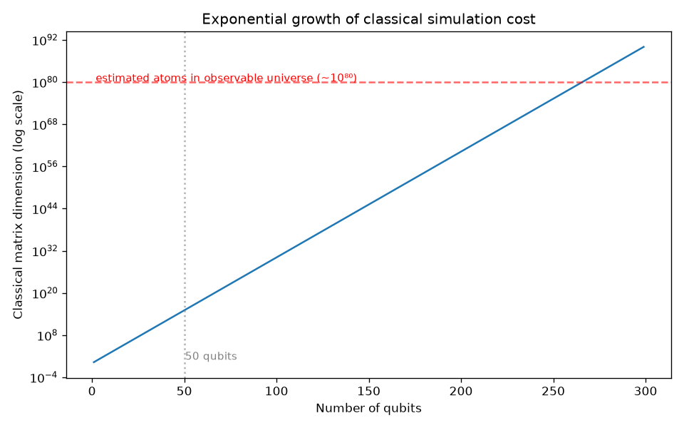

# Computational Quantum Mechanics: From Wavepackets to Quantum Circuits

A self-directed project connecting continuous-space quantum mechanics 
(Schrödinger equation, tunnelling, bound states) to discrete quantum 
information (qubits, circuits, Trotterised time evolution), built around 
a single guiding question: a classical numerical solver and a quantum 
circuit can both simulate the same physical system, where does that 
analogy hold, and where does it break?

## Setup
Requires Python 3.11+ with numpy, scipy, matplotlib, and qiskit installed.
pip install numpy scipy matplotlib qiskit qiskit-aer

## Structure

- **`src/`** — Part 1: numerical solutions of the time-dependent and 
  time-independent Schrödinger equation (split-step Fourier method), 
  five validated scenarios
- **`notebooks/part2_qiskit.ipynb`** — Part 2: qubits, superposition, 
  measurement, and entanglement in Qiskit
- **`notebooks/part3_*.ipynb`** — Part 3: Trotterised time evolution, 
  transmon anharmonicity, Rabi oscillations, and decoherence (T1/T2), 
  bridging Parts 1 and 2
- **`notes/`** — working derivations and reasoning behind each extension
- **`figures/`** — all generated plots and animations

## Part 1: Continuous quantum mechanics

| Scenario | Result |
|---|---|
| Free particle | Wavepacket spreading and drift, a purely quantum effect |
| Potential step | Reflection/transmission validated against theory; threshold discrepancy explained via the wavepacket's momentum spread |
| Barrier tunnelling | Real tunnelling measured (T=0.005) where classically forbidden; T vs E sweep reveals exponential sensitivity to energy spread |
| Bound states | Harmonic oscillator spectrum recovered to 4 significant figures via finite-difference diagonalisation |
| Double well | Coherent tunnelling oscillation between wells, matching the predicted period to <0.1% — the same mechanism underlying flux/charge qubits |

## Part 2: Discrete quantum information

Qubit states, superposition, and measurement statistics are built and 
verified against the Born rule. Entanglement is constructed and proven 
non-separable algebraically, then flagged explicitly as the one concept 
with no single-particle analogue in Part 1.

## Part 3: Bridging the two

- **Trotterisation**: e^{-iHt} approximated as a quantum circuit for both 
  a single qubit and a two-qubit interacting system, validated against 
  exact matrix exponentiation
- **Symmetric vs asymmetric splitting**: despite theory favouring the 
  symmetric method Part 1 uses, it showed no measurable advantage on a 
  circuit, and its extra gate cost would make it worse in practice on 
  real, noisy hardware
- **Entanglement growth**: two initially unentangled qubits become 
  entangled purely through Hamiltonian evolution

  

- **Transmon derivation**: diagonalising the actual Josephson-junction 
  potential (not just a harmonic approximation) recovers a real, 
  physically-relevant anharmonicity, the design feature that makes 
  superconducting qubits usable two-level systems
- **Rabi oscillations**: driven qubit control, with an explicit 
  gate-speed vs. selectivity tradeoff derived from the transmon's own 
  anharmonicity

  

- **Decoherence (T1/T2)**: the Lindblad master equation, validated 
  against analytic decay laws, connecting back to real hardware 
  coherence-to-gate-time ratios

- **Why it matters**: classical simulation cost grows exponentially with 
  qubit count (crossing the estimated number of atoms in the observable 
  universe at ~266 qubits), while Trotterised gate count grows only 
  polynomially, the computational wall motivating Feynman's original 
  argument for quantum computing

  

## Certifications

Qiskit Global Summer School 2026, IBM Quantum — Certificate of Completion

## Tech stack

Python, NumPy, SciPy, Matplotlib, Qiskit, Qiskit Aer

## Full writeup
A complete technical writeup, covering the physics, derivations, and 
honest limitations of every result above, is available in 
[`writeup/writeup.md`](writeup/writeup.md).
