# Introduction

A classical numerical solver and a quantum circuit can both simulate the same physical system. This project is built around one question: where does that analogy hold, and where does it break?

Richard Feynman's 1982 argument for quantum computers was that simulating a quantum system classically requires resources that grow exponentially with system size. A quantum computer instead could simulate another quantum system and avoid that exponential cost. This is not hypothetical, representing the full state of 50 qubits classically already exceeds what any computer could hold in memory, and real quantum processors already exceed 100 qubits. IBM's Nighthawk has 120, and Google's Willow has 105. Current hardware is already at a scale no classical computer could fully simulate, even in principle. These devices are also improving in quality: Google's Willow has demonstrated single-qubit gate fidelities of 99.97%, giving a concrete sense of how precisely a real physical qubit can now be controlled.

This project explores both sides of that argument directly.

Part 1 builds a classical numerical solver for the time-dependent and time-independent Schrödinger equation. It simulates a single particle in continuous space across five scenarios: free propagation, scattering from a potential step, tunnelling through a finite barrier, quantised bound states, and coherent oscillation in a double well. The physics here is largely familiar from second-year quantum mechanics. The focus is on the numerical methods needed to simulate it, discretisation, solver choice, and validating results against analytical theory.

Part 2 introduces the discrete language of quantum computing. Qubits, superposition, measurement, and entanglement are built and verified using Qiskit.

Part 3 connects Part 1 and Part 2. Trotterisation, the technique for implementing time evolution as a quantum circuit, turns out to be the same operator-splitting idea used in Part 1's solver. This is validated on a single qubit and on a two-qubit interacting system, where it correctly reproduces real entanglement growth. The project then shifts from simulating quantum systems to controlling real ones. A physically accurate qubit's anharmonicity is derived from first principles and used to analyse the tradeoffs of driven qubit control. Finally, decoherence is examined, the real-world limit on how long any of this control stays usable at all.

# Part 1: Continuous quantum mechanics

To investigate continuous quantum mechanics, we built a solver that classically simulates the time-dependent Schrödinger equation on a grid, our "quantum system."

Our setup involved building spatial and momentum grids, and investigating a Gaussian wavepacket over scenarios, parameterised by its centre position, width, and initial momentum.

We used the split-step Fourier method, where at each timestep:
1. we apply half a step of potential energy evolution in position space, multiplying $\psi(x)$ by $e^{-iV(x)\Delta t/2\hbar}$
2. we Fourier transform, apply a full step of kinetic energy evolution in momentum space, multiplying by $e^{-i\hbar k^2\Delta t/2m}$
3. we inverse transform and apply the final half step of potential energy, multiplying by $e^{-iV(x)\Delta t/2\hbar}$ again.

Time evolution in quantum mechanics corresponds to applying $e^{-i\hat{H}t}$ to a state, where $\hat{H}=\hat{T}+\hat{V}$. Since $\hat{T}$ and $\hat{V}$ do not commute, $e^{-i(\hat{T}+\hat{V})\Delta t}$ cannot be split exactly. An asymmetric split, $e^{-i\hat{V}\Delta t}e^{-i\hat{T}\Delta t}$, has an error of order $\Delta t^2$ per step. The symmetric version used here, half a potential step, a full kinetic step, half a potential step, instead has an error of order $\Delta t^3$ per step, improving per-step accuracy at no additional computational cost.

We set $\hbar=1$ and $m=1$, standard for numerical QM simulations. At each stage, total probability conservation ($\int |\psi|^2 \, dx = 1$) was verified numerically as a basic correctness check before extracting any physical result.

This section establishes how quantum behaviour manifests in continuous space. We look at spreading, interference, tunnelling, and quantisation, and provide the physical grounding for Part 3's central question: how much of this behaviour survives when the same physics is instead built from discrete qubits and circuits?

## 1. Free particle

A free particle wavepacket is expected to drift according to its initial momentum and spread over time, a purely quantum mechanical effect with no classical analogue for a localised particle. We simulated a Gaussian wavepacket with initial position $x_0=-50$ and momentum $k_0=2.0$, evolving under zero potential ($V(x)=0$), and compared its shape at $t=0$ against its shape after 400 timesteps.

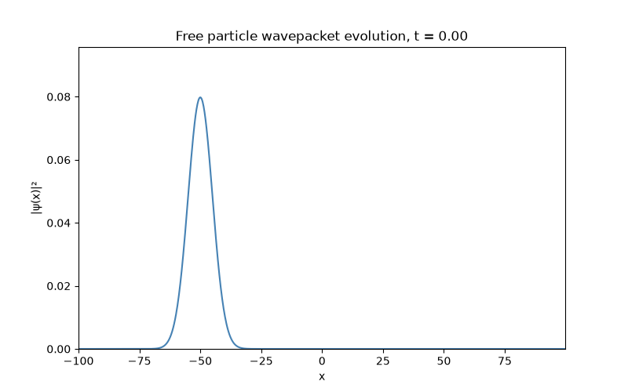

The wavepacket moved to the right, consistent with its initial momentum, and visibly widened, with its peak height dropping correspondingly, confirming both effects predicted above. This spreading occurs because a Gaussian wavepacket is not a single momentum eigenstate but a superposition of many momentum components, each propagating at its own group velocity. Since these components travel at slightly different speeds, they gradually separate over time, causing the packet to broaden. This occurs without external influence; the particle has not encountered any barrier or change in potential. A classical point particle with a single well-defined velocity would show no such spreading, this broadening is a direct consequence of the wavepacket's inherent momentum uncertainty.

## 2. Potential step

Quantum mechanics predicts that when a wavepacket with mean energy comparable to a potential step's height approaches the step, some reflection occurs, even though classically the particle should simply pass through. To simulate the classical threshold ($V_0=E$), we used a step of height $V_0=2.0$ at $x=0$, chosen to match the wavepacket's mean kinetic energy, $E\approx k_0^2/2=2.0$.

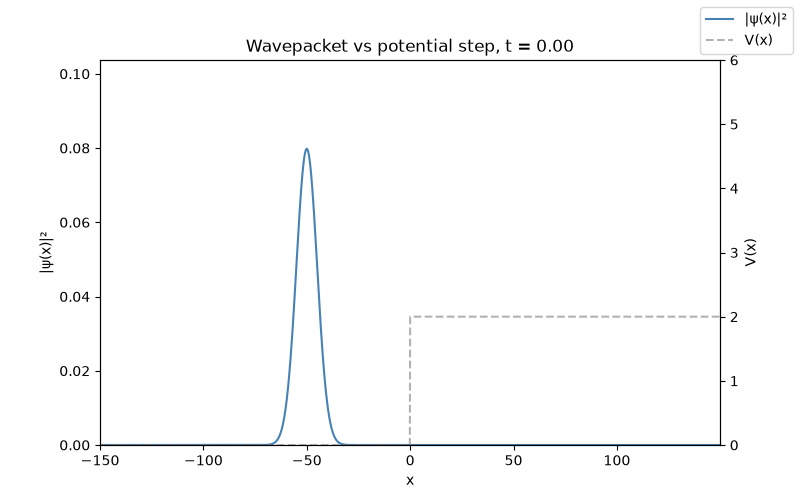

We observed interference between the transmitted and reflected waves at the boundary of the potential step, creating a jagged, rippled effect before the two pieces fully separate and move apart.

By integrating $|\psi(x)|^2$ on either side of the step's location, we numerically measured the reflection and transmission probabilities, $R$ and $T$. For a step below the mean energy, $R=0.032$ and $T=0.968$, agreeing with plane-wave theory ($R=0.029$, $T=0.971$) to within a few percent. This agreement confirms the numerical method itself is accurate, allowing the at-threshold discrepancy discussed below to be attributed to genuine physics rather than simulation error.

At the threshold itself ($V_0=E$), plane-wave theory predicts total reflection ($R=1$, $T=0$), while the simulation gave $R=0.690$, $T=0.310$. This is because a wavepacket, unlike a plane wave, is a superposition of many momenta rather than a single sharp energy; components of the momentum distribution with energy above $V_0$ transmit largely unimpeded, contributing disproportionately to the measured transmission.

To confirm this directly, we constructed a momentum-space plot showing the wavepacket's energy distribution relative to $V_0$, finding that 49.9% of the distribution already exceeds the threshold, explaining why substantial transmission occurs even where idealised single-energy theory predicts none.

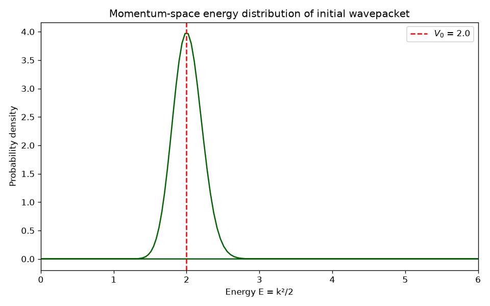

This same reasoning (that a wavepacket's energy spread causes measurable deviations from single-energy theory), reappears in a more dramatic form in the next section, where it produces transmission many orders of magnitude larger than expected.

## 3. Finite barrier

For a barrier with V₀ > E, classical mechanics predicts zero transmission, the particle simply lacks the energy to cross the barrier. However, quantum mechanically, tunnelling allows a small but nonzero transmission probability, even in this classically forbidden regime.

Using a barrier of $V_0=3.0$, above the wavepacket's mean energy ($E=2.0$), the simulation gave $R=0.9950$, $T=0.0050$, small, but definitively nonzero where classical physics demands exactly zero, confirming real tunnelling.

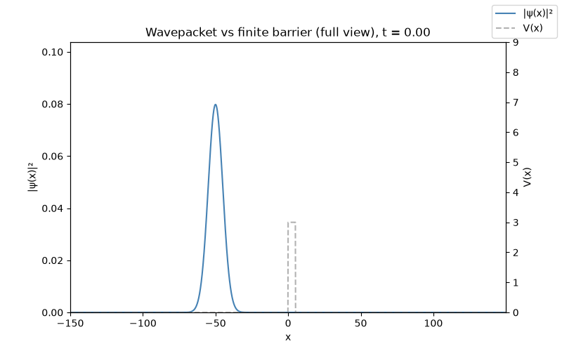

On a linear scale, the transmitted component is invisible against the dominant reflected peak. A zoomed, log-scale view isolates the small transmitted signal.

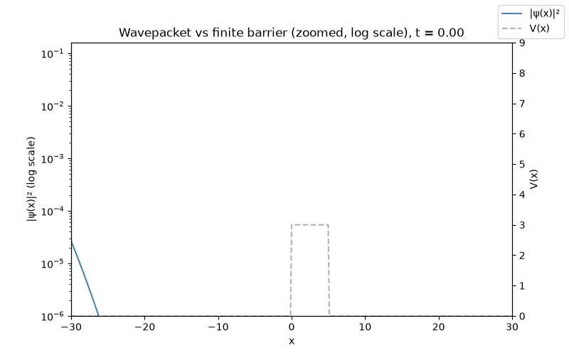

To investigate this further, we extracted the transmission coefficient as a function of energy by repeating this measurement across a range of incident energies, comparing against the analytic tunnelling formula.

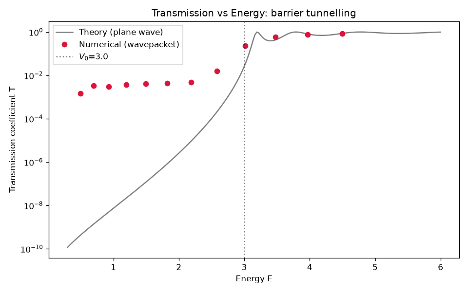

At energies well below V₀, the measured T was orders of magnitude larger than plane-wave theory predicts. This is because tunnelling probability depends exponentially on energy, $T\sim e^{-2\sqrt{2(V_0-E)}a}$, so even a small high-energy tail in the wavepacket's momentum distribution contributes disproportionately to the average transmission. On the other hand, above the barrier, transmission varies only oscillatorily with energy rather than exponentially, so the same momentum spread averages out far more gently, and the measured T agrees closely with theory in this regime.

This exponential sensitivity means that realistic wavepackets (which always carry some energy spread), transmit substantially more than idealised single-energy theory predicts. This has direct physical relevance: any real particle beam or thermal distribution carries energy spread, so tunnelling-based phenomena, from scanning tunnelling microscopy to leakage currents in nanoscale transistors, are systematically underestimated by single-energy approximations in practice.

## 4. Bound state

Unlike the previous three scenarios, which looked at how a wavepacket evolves over time, this section looks instead at the question: which wavefunctions don't evolve in shape at all, only accumulating an overall phase? These are the stationary states, solutions to the time-independent Schrödinger equation. Therefore, this scenario is an eigenvalue problem rather than a time-evolution problem.

We modelled the quantum harmonic oscillator specifically, rather than a simpler potential such as an infinite square well, because its potential, $V(x)=\frac12\omega^2x^2$, is the same mathematical structure underlying real superconducting qubits near their operating point, a connection developed further in Part 3.

On a discretised grid of N points, the Hamiltonian $\hat H$ becomes an $N\times N$ matrix acting on the wavefunction as a finite vector, and finding its eigenvalues and eigenvectors becomes an ordinary linear algebra problem. The potential term acts diagonally, contributing $V(x_i)$ to row $i$ and zero elsewhere. The kinetic term, $-\frac12\frac{d^2}{dx^2}$, requires a standard finite-difference approximation for the second derivative, which couples each grid point only to its immediate neighbours. This produces a tridiagonal matrix, nonzero only on the main diagonal and the two adjacent diagonals, which can be diagonalised efficiently using `scipy.linalg.eigh_tridiagonal`.

For the harmonic oscillator potential, the six lowest computed eigenvalues (the quantised energy levels) matched the theoretical prediction $E_n=(n+0.5)\omega$ to four decimal places for the ground state. The discrepancy grew slightly for higher states (from ~5×10⁻⁵ at n=0 to ~3×10⁻³ at n=5).

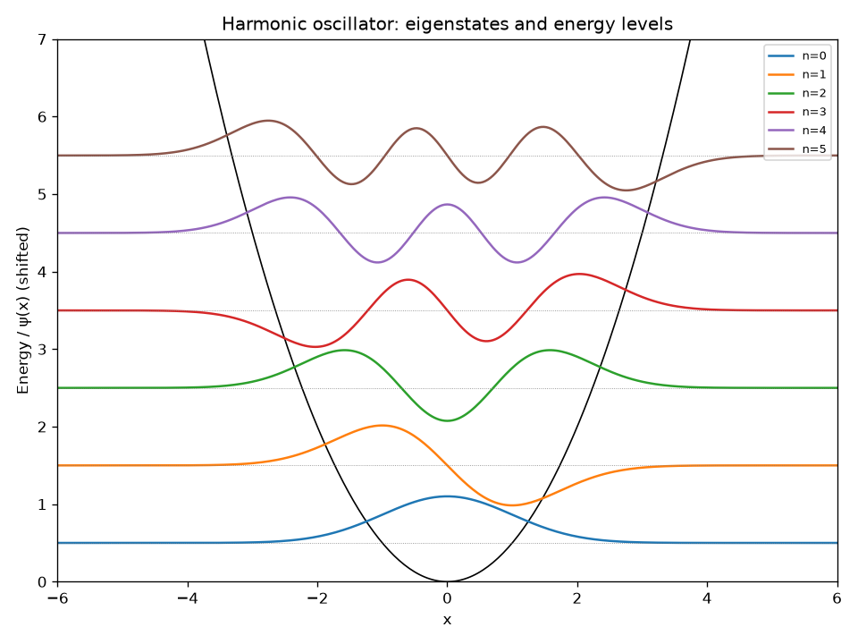

We expected this pattern. The finite-difference approximation is accurate only to order $\Delta x^2$, and higher eigenstates oscillate more rapidly in space, so the same fixed grid spacing approximates less accurately. This is visible directly in the eigenstates plot: the ground state ($n=0$) is a single smooth bump with no nodes, while each successive state gains exactly one additional node, a general feature of bound-state wavefunctions, and the states shown here reproduce it correctly.

Our computed spectrum is evenly spaced by exactly $\omega=1$ between consecutive levels, the known signature of the harmonic oscillator. This perfectly even spacing is used later as the baseline which Part 3's transmon calculation will be compared against. Real superconducting qubits are built from a related but slightly different potential, and how it deviates from the result derived here is what makes a qubit usable as a two-level system.

## 5. Double Well

Another scenario that will aid the link to qubits as a two-level system, is looking at a double well. A double well potential, $V(x)=V_0\left(\frac{x^2}{a^2}-1\right)^2$, extends tunnelling into coherent, oscillatory tunnelling.

Using the same eigenvalue method as the previous section, we computed the two lowest eigenstates, $\psi_+$ (symmetric) and $\psi_-$ (antisymmetric). These two eigenstates are split by a small energy gap $\Delta E=E_--E_+$, the tunnelling splitting. A particle initially localised in one well will periodically swap between the two superpositions of $\psi_{\text{left}}=\frac{1}{\sqrt2}(\psi_++\psi_-)$ and $\psi_{\text{right}}=\frac{1}{\sqrt2}(\psi_+-\psi_-)$, with a predicted oscillation period $T=2\pi/\Delta E$. This is because $\psi_+$ and $\psi_-$ have slightly different energies, so the superposition of the two wavefunctions is not stationary.

Our initial choice of well parameters gave a splitting of $\Delta E\approx6\times10^{-5}$, corresponding to an oscillation period of over 100,000 time units, which is too long to simulate practically. Instead, we used $V_0=1.0$, $a=1.5$ (shallower, thinner walls) to give a splitting of $\Delta E=0.294$, a period of $T\approx21.4$. We ensured the gap to the next pair of states ($\Delta\approx1.10$) was larger than the splitting itself, so that the system remains a clean two-level system rather than leaking into higher states.

We evolved $\psi_{\text{left}}$ under the same split-step solver used throughout Part 1, and tracked the probability of finding the particle in the left half of space, $\int_{x<0}|\psi(x,t)|^2dx$, as a function of time. The probability should fall as the particle tunnels into the right well, reaching a minimum at half the predicted period, before rising back. Our simulation gave a minimum at $t=10.70$, against the independently-predicted $T/2=10.69$, agreement to within 0.1%.

This validates our demonstration of coherent quantum tunnelling, the same physical mechanism underlying flux and charge qubit designs used in real quantum hardware.

## Part 1 summary

Across five scenarios, we used the split-step Fourier solver and the finite-difference eigenvalue method to reproduce a range of quantum phenomena: wavepacket spreading with no classical analogue, partial reflection at a step where classical mechanics predicts none, real tunnelling through a barrier that grows into coherent oscillation between two wells, and a discretely quantised energy spectrum.

These results are connected by the fact that a physical wavepacket carries a spread of momenta instead of a single sharp energy, therefore idealised single-energy predictions break down at different scales.

Furthermore, the bound state and double well scenarios respectively show routes where continuous quantum mechanics can produce the discrete, two-level structure used by qubits. These underlying ideas motivate the discrete circuit formalism developed in Part 2, and will be discussed and linked in Part 3.

# Part 2: Discrete quantum information

Part 1 explored the time-dependent and time-independent Schrödinger equation for a single particle in continuous space. Part 2 takes the same core ideas (superposition, probability, measurement) into the discrete language of quantum circuits, with each concept mapped explicitly onto its Part 1 counterpart:

- **Qubit as a truncated two-level system**, corresponding to the lowest two levels ($n=0$, $n=1$) of the harmonic oscillator considered in Part 1
- **Superposition**, corresponding to the wavepacket's own superposition of momentum components
- **Measurement statistics**, the discrete Born rule, corresponding to $|\psi(x)|^2$ as a continuous probability density
- **Entanglement**, which, as discussed at the end of this section, has no single-particle analogue in Part 1

## What is a qubit?

A qubit, a quantum bit, is the quantum analogue of a classical bit. Instead of being restricted to only 0 or 1, a qubit can exist in a superposition of both, and takes the general form $|\psi\rangle=\alpha|0\rangle+\beta|1\rangle$, a two-component vector with complex amplitudes $\alpha,\beta$.

Physically, a qubit is a truncation of a real system's ladder of energy levels to its two lowest levels, $E_0$ and $E_1$ (the two lowest bound states in Part 1's harmonic oscillator). The higher levels are assumed inaccessible.

We confirmed that a newly initialised qubit has amplitude 1 on $|0\rangle$ and 0 on $|1\rangle$, the discrete analogue of a bound system occupying its ground state until disturbed.

## Superposition and measurement

Applying a Hadamard gate to $|0\rangle$ produces the equal superposition $\frac{1}{\sqrt2}(|0\rangle+|1\rangle)$. Upon measurement, the superposition collapses; you can only measure 0 or 1, with $P(\text{measure }0)=|\alpha|^2$ and $P(\text{measure }1)=|\beta|^2$. The resulting state vector had both amplitudes equal to $\approx0.707$, giving probabilities $P(0)=P(1)=0.5$, summing to 1 within floating-point precision, as verified directly. This is the discrete, qubit version of applying the Born rule to a probability distribution.

We tested this prediction against actual measurement statistics: running 1000 shots gave counts of 507 and 493 for outcomes 0 and 1 respectively, close to the predicted 50/50 split. The small deviation is expected from statistical fluctuation, not error.

## Entanglement

Entanglement is fundamentally different from superposition and measurement because it requires at least two qubits; there is no single-particle analogue in Part 1. A two-qubit state is called separable if it can be written as a product of two independent single-qubit states, $|\psi\rangle=|\phi_A\rangle\otimes|\phi_B\rangle$. If not, it is entangled.

To represent the simplest and most fundamental example of maximal entanglement, we constructed the Bell state $\frac{1}{\sqrt2}(|00\rangle+|11\rangle)$. The resulting vector showed amplitude $\frac{1}{\sqrt2}$ on $|00\rangle$ and $|11\rangle$, and exactly zero on $|01\rangle$ and $|10\rangle$. We further confirmed this by measurement: across 1000 shots, only $|00\rangle$ (515 counts) and $|11\rangle$ (485 counts) appeared, with the mixed outcomes never observed.

This can be proven algebraically. A separable two-qubit state means that qubit A and qubit B's states can be described independently, completely on their own. Suppose qubit A has state $\alpha|0\rangle+\beta|1\rangle$ and qubit B has state $\gamma|0\rangle+\delta|1\rangle$. If the qubits were separable, combining them means multiplying these two expressions together, giving four terms:
$$\alpha\gamma|00\rangle+\alpha\delta|01\rangle+\beta\gamma|10\rangle+\beta\delta|11\rangle$$

The real Bell state has nonzero amplitude on $|00\rangle$ and $|11\rangle$, and exactly zero amplitude on $|01\rangle$ and $|10\rangle$, so the four terms would have to satisfy:
$$\alpha\gamma\neq0,\quad \beta\delta\neq0,\quad \alpha\delta=0,\quad \beta\gamma=0$$

Since $\alpha\gamma\neq0$, both $\alpha$ and $\gamma$ must individually be nonzero. Similarly, as $\beta\delta\neq0$, both $\beta$ and $\delta$ must individually be nonzero. However, $\alpha$ and $\delta$ were both just established as nonzero, so their product $\alpha\delta$ cannot be zero, directly contradicting the requirement $\alpha\delta=0$. No choice of $\alpha,\beta,\gamma,\delta$ can satisfy all four conditions simultaneously. The assumption that the Bell state is separable is therefore mathematically impossible; the qubits are entangled, fundamentally linked in a way that has no classical, independent description.

## Part 2 summary

Part 2 establishes the qubit as a truncated two-level system, corresponding to the two lowest energy levels of the harmonic oscillator. Superposition, measurement, and entanglement are explored in the discrete context of quantum circuits to build up what a qubit is and how it behaves. Using the Bell state, we proved algebraically that entanglement requires at least two subsystems whose joint state cannot be factored into independent parts. Single-particle wavepacket dynamics, as explored throughout Part 1, cannot exhibit this phenomenon.

# Part 3: Bridging the two

In Part 3, we link Part 1's continuous time evolution and Part 2's discrete circuits to explore the bridge between a classical solver and a quantum circuit both simulating the same system. We start by implementing $e^{-i\hat{H}t}$, the time evolution operator of a given Hamiltonian $\hat{H}$, as a circuit. This requires Trotterisation.

We first validate Trotterisation on a single qubit, then extend it to a two-qubit interacting system before looking at how a qubit is controlled and constrained on real hardware, covering the transmon's energy structure, driven qubit control, and decoherence.

## Trotterisation

Trotterisation is a technique to approximate the time evolution of a Hamiltonian as a sequence of simpler, individually-implementable rotations.

Firstly, we computed the ground truth exact time evolution as a base case, under $H=aX+bZ$ via direct matrix exponentiation, a field with components along two different axes. This produced oscillating $\langle Z\rangle$, verifying quantum precession driven by the non-commuting terms $X$ and $Z$. This is because if $H$ didn't have an $X$ term and was just $Z$, starting in $|0\rangle$, we would be in an eigenstate of $H$, which only accumulates an overall phase under time evolution, and $\langle Z\rangle$ would stay constant. In contrast, here our Hamiltonian mixes $X$ and $Z$, so $|0\rangle$ is not an eigenstate, and the different phases in our superposition of $H$'s eigenstates drift and interfere with each other, leading to physical precession and oscillation over time. We will check our Trotterisation circuit against this later.

Since $X$ and $Z$ do not commute, when implementing the time evolution operator, $e^{-i(aX+bZ)t}$ is not $e^{-iaXt}e^{-ibZt}$. We saw this in Part 1, where we used the split-step method. Here, on a quantum circuit, first-order Trotterisation is a technique that breaks total time $t$ into $n$ steps, $\Delta t=t/n$, so that $e^{-i(aX+bZ)t}$ is approximately $\left(e^{-iaX\Delta t}e^{-ibZ\Delta t}\right)^n$. This means that each factor is individually a "native" gate ($R_x$, $R_z$). A native gate is a standard and directly implementable building block that doesn't require further decomposition in Qiskit or on real hardware. This approximation gets better with more steps because the error shrinks linearly as you increase $n$, by the Baker-Campbell-Hausdorff formula:
$$e^Ae^B=e^{A+B+\frac12[A,B]+\dots}$$
The correction term involves the commutator $[A,B]$, where $A,B\sim\Delta t$, so the leading error term is $O(\Delta t^2)$ per step. Over $n=t/\Delta t$ steps, the accumulated error scales as $n\cdot\Delta t^2=t^2/n$, which is $O(1/n)$, the generic first-order Trotter bound.

*Figure: quantum circuit diagram of the repeated $R_x$–$R_z$ Trotter block (illustrative circuit, generate via `qc.draw('mpl')` and save to `figures/single_qubit_trotter_circuit.png` to embed here).*

Each repeated $R_x$-$R_z$ block is one Trotter step. Therefore, more steps mean a better approximation to the exact evolution.

To investigate this, we first compared the Trotterised curve against the exact time evolution curve over a variation of step counts, and verified that at a higher step count, e.g. $n=50$, the two curves were indistinguishable, while a low step count, e.g. $n=10$, showed disagreement as the Hamiltonian evolved. This confirms the approximation depends on step count.

To quantify this, we computed the Trotter error (max deviation in $\langle Z\rangle$ from the exact solution) across a range of step counts.

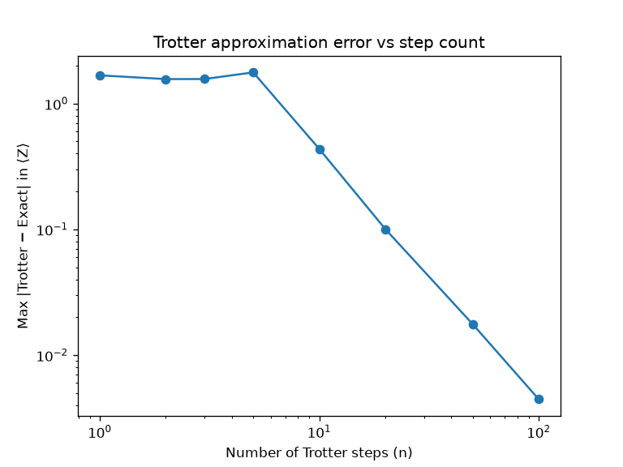

We plotted on a log-log scale to reveal the error scaling and compare it to the Trotter bound mentioned above.

We observed two regions:

1. **A saturated regime ($n=1$–$5$):** The Trotter error lies consistently near 1.5–1.8, close to the maximum possible difference between two numbers bounded in $[-1,1]$. At such a low number of steps, the approximation is not in a regime where any scaling law applies.
2. **A power-law regime ($n\geq10$):** Fitting this region gave a slope of approximately $-2$, indicating that the Trotter error $\sim O(1/n^2)$. This is better than the generic worst-case Trotter bound of $O(1/n)$. This is consistent with the general understanding that Trotter error bounds represent worst-case scaling, and are frequently not tight for small, low-dimensional systems such as this one.

This used a simple, asymmetric first-order split, whereas Part 1's split-step solver instead used a symmetric split specifically for better accuracy. The next section tests whether that same benefit carries over when Trotterisation is implemented as a circuit.

## Symmetric vs asymmetric

Part 1's split-step solver evolved the Schrödinger equation using a symmetric structure, a method known in numerical analysis as "Strang splitting." In contrast, the single-qubit Trotter circuit in the previous section used the asymmetric Lie-Trotter form instead. Since Strang splitting is designed to cancel the leading-order error term, and Part 1 deliberately used it for this reason, we tested whether the same benefit carries over to a circuit implementation, by building a symmetric version of the single-qubit Trotter circuit (half-$a$, full-$b$, half-$a$) and comparing its convergence directly against the asymmetric version.

To compare the two, we fitted the log-log slope of the maximum $|\text{Trotter}-\text{exact}|$ deviation in $\langle Z\rangle$ against the number of Trotter steps, for both methods. On a log-log plot, a power law $\text{error}\sim C/n^p$ appears as a straight line, with slope equal to $-p$, so fitting this slope directly extracts the convergence order $p$ for each method.

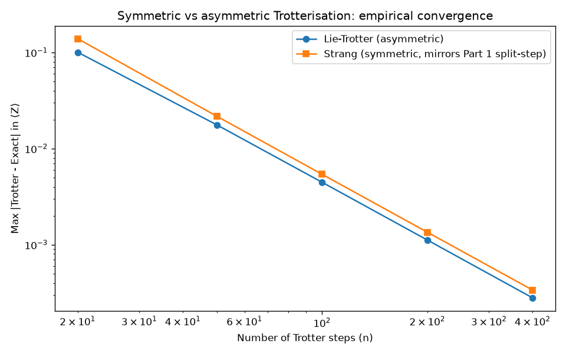

The results were:
- Fitted slope, Lie-Trotter: $-1.968$
- Fitted slope, Strang: $-2.009$
- Error ratio (Strang/Lie) across $n$: $[1.383, 1.229, 1.211, 1.207, 1.205]$
- Coefficient of variation of ratio: $0.055$

Both fitted slopes are consistent with $O(1/n^2)$ scaling, and the error ratio converges to $\approx1.21$ as $n$ increases. This confirms that both errors shrink at the same rate as the number of steps increases. They only differ by a fixed multiplicative constant (Strang's error is consistently about 21% larger).

This was unexpected as based on our Part 1's reasoning for using symmetric splitting, we expected Strang splitting to outperform Lie-Trotter. Instead, for this specific two-level system and observable, the expected advantage of Strang splitting was not apparent.

Rather than a flaw in the theory, we traced this to a practical cost: Strang splitting requires 3 gates per step ($R_x$-$R_z$-$R_x$), while Lie-Trotter requires only 2 ($R_x$-$R_z$). On real hardware, every gate introduces its own physical error, from imprecise pulse timing, unwanted interactions, or decoherence during the gate itself. If Strang gives no measurable accuracy benefit here but costs 50% more gates, it would perform worse in practice than the "theoretically better" method, since the extra gate's own physical error outweighs an algorithmic improvement that, for this system, does not even manifest. This illustrates a genuine tension in near-term quantum computing: a method that is better in idealised error-scaling theory is not always better once real gate infidelity is accounted for.

## Two-qubit entanglement growth

After validating Trotterisation on a single qubit, we extended it to a two-qubit interacting system. This was so we could test Trotterisation on a more complex Hamiltonian, and to explore entanglement dynamically, something Part 2 explicitly identified as impossible to demonstrate with a single particle. (A single qubit can never become entangled with anything, entanglement requires at least two subsystems.)

We used the Hamiltonian $H=JZ_1Z_2+h(X_1+X_2)$. The first term, $Z_1Z_2$, applies $Z$ to each qubit simultaneously. Since $Z$ has eigenvalues $+1$ for $|0\rangle$ and $-1$ for $|1\rangle$, this term gives $+1$ whenever the two qubits agree (both 0 or both 1) and $-1$ whenever they disagree. This makes it an interaction term, physically analogous to two coupled spins. The second term, $h(X_1+X_2)$, applies $X$ independently to each qubit, with no coupling between them at all. This is a local field/drive acting on each qubit on its own, the same type of term used later for Rabi driving.

Critically, the local field term does not commute with the interaction term, since $X$ and $Z$ do not commute for a single qubit. This means that the two terms are constantly working against each other: $JZ_1Z_2$ builds correlation between the qubits, while $h(X_1+X_2)$ continually tries to rotate each qubit individually, away from that correlation. This competition is what makes the resulting dynamics interesting.

To quantify how entangled the two qubits become over time, we tracked the entanglement entropy of one qubit, $S=-\text{Tr}(\rho_1\log_2\rho_1)$, where $\rho_1$ is qubit 1's reduced density matrix, obtained by tracing out qubit 2. This quantity measures how mixed, or uncertain, qubit 1's state appears once qubit 2 is ignored entirely: $S=0$ means qubit 1 is in a definite, pure state (no entanglement with qubit 2), while $S=1$, the maximum possible value for a single qubit, means qubit 1 is maximally entangled with qubit 2.

As shown on the plot, the Trotterised circuit's entropy curve converges toward the exact result as the number of Trotter steps increases. This is the same step-count-dependent convergence validated for the single-qubit case, now demonstrated for a multi-qubit, dynamically-entangling system.

Starting from the unentangled state $|00\rangle$, entropy rises as the $JZ_1Z_2$ interaction builds correlation between the qubits. The local field term continues rotating each qubit individually throughout, partially undoing and rebuilding the entanglement as the system evolves, producing oscillatory rather than steadily saturating growth. The peaks are not perfectly periodic either, as the interaction and local field terms do not commute. This means that the dynamics are not simple periodic rotation, but rather a more complex, quasi-periodic beating between multiple frequencies set by the relative strengths of $J$ and $h$.

## Gate count vs classical scaling

Feynman's original 1982 argument for why quantum computers should exist at all was that simulating a quantum system on a classical computer requires resources that grow exponentially with system size, while a quantum computer, built from the same underlying physics, could simulate another quantum system natively, without that exponential blowup.

To investigate this directly, we plotted classical storage requirements as a function of qubit count.

On this log scale, a straight line is the signature of exponential growth: $\log(2^n)=n\log(2)$, a constant slope. At $n=30$, this already reaches $\sim10^9$, a billion-dimensional matrix; by $n=50$, $\sim10^{15}$, beyond what any classical computer could hold in memory.

Extending the range shows classical storage crossing the estimated number of atoms in the observable universe ($\sim10^{80}$) at roughly 266 qubits. Real quantum processors already exceed 100 qubits (IBM Nighthawk: 120, Google Willow: 105), meaning no classical computer could store the full state vector these devices already operate on. This means that for systems at this scale, brute-force classical simulation is physically impossible regardless of how much computing power might ever become available, since there is not enough matter in the observable universe to store the required state vector.

Despite this, we have not yet shown why Trotterisation specifically, rather than quantum simulation in general, is a practical approach. The distinguishing claim is that a Trotterised circuit's gate count grows only polynomially with qubit number, in contrast to classical exact diagonalisation, directly constructing and diagonalising the full $2^N\times2^N$ Hamiltonian matrix, whose cost grows exponentially.

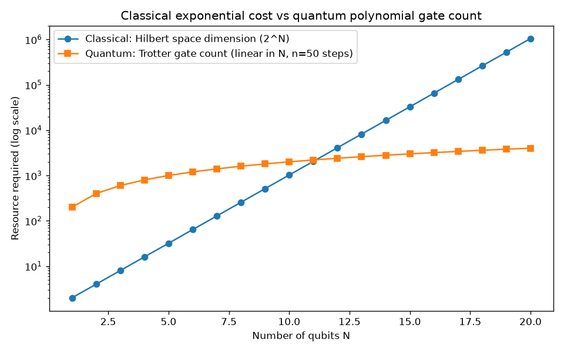

For a nearest-neighbour interacting chain (extending the two-qubit model to $N$ qubits), each Trotter step requires roughly $(N-1)$ $ZZ$-interaction gadgets (3 gates each) plus $N$ single-qubit rotations, approximately $4N$ gates per step, linear in $N$. At $N=20$ qubits, classical storage requires over a million complex numbers, while a Trotterised circuit with 50 steps needs only 4000 gates.

This project does not claim that Trotterisation is the optimal quantum algorithm for this task, nor do we claim that no classical method could ever do better for specific structured Hamiltonians. What this comparison shows is the specific computational wall that motivated Feynman's original argument: not that quantum methods are simply faster, but that a polynomial-scaling method remains feasible in principle at system sizes where exponential methods become physically impossible.

## Transmon

What is a Transmon?
A transmon is the specific circuit design used by IBM, Google, and most superconducting qubit companies. It is a nonlinear LC oscillator, where an inductor is replaced by a Josephson junction (a thin insulating barrier between two superconductors), giving a potential $V(\phi)=-E_J\cos(\phi)$ instead of the pure harmonic $\frac12\omega^2x^2$ considered in Part 1.

Here, $\phi$ is the superconducting phase difference across the junction, playing the same role position $x$ played in Part 1's bound-state problem, and $\hat n=-i\frac{d}{d\phi}$, the charge number operator, plays the role of momentum in Part 1. The two are conjugate variables in the same sense as position and momentum. The full transmon Hamiltonian is:
$$H=4E_C\hat n^2-E_J\cos(\hat\phi)$$
where $E_C$ is the charging energy and $E_J$ the Josephson energy.

The system spends most of its time near $\phi=0$, the minimum of the potential, for the same reason a particle in Part 1's harmonic oscillator was mostly found near its own potential minimum: low-lying energy states are localised close to where the potential is smallest. This makes a Taylor expansion around $\phi=0$ directly relevant to describing the low energy levels we actually care about: $\cos(\phi)\approx1-\frac{\phi^2}{2}+\frac{\phi^4}{24}-\dots$. The first two terms recover the pure harmonic oscillator from Part 1 exactly. The $\phi^4$ correction makes the energy levels unevenly spaced (anharmonic), letting us address the $0\to1$ transition with a specific drive frequency without also accidentally exciting $1\to2$. This matters directly because of how qubits are built from a truncated ladder of energy levels, as described in Part 2.

We derived the transmon's energy levels $E_1-E_0$ and the anharmonicity between adjacent gaps by diagonalising this Hamiltonian numerically. We reused the same finite-difference eigenvalue method from Part 1's bound-state scenario, using the Josephson potential in place of the harmonic one.

The lowest four eigenvalues were $[-40.257,-21.315,-3.521,12.986]$, giving:
$E_1-E_0=18.9419$ (compared to the harmonic approximation $\sqrt{8E_CE_J}=20.0000$) and $E_2-E_1=17.7938$.
The anharmonicity, $(E_2-E_1)-(E_1-E_0)=-1.1480$, compares closely to the analytic approximation $-E_C=-1.0000$.

This matters directly to the story built across this project. Part 1 started with a pure harmonic oscillator, showing perfectly even energy spacing. Here, replacing the harmonic potential with the actual physical potential used in real superconducting qubits introduces a small, specific, analytically-predictable anharmonicity, the design feature that makes transmons usable two-level systems. Since the ladder is no longer evenly spaced between $E_1-E_0$ and $E_2-E_1$, driving at one frequency to control a qubit is off-resonance for the other transitions, suppressing them and yielding a clean two-level system. As a result of this, it resolves the truncation problem raised in Part 2 with a real physical mechanism rather than an assumption. However, this cannot be pushed arbitrarily far. If $E_J/E_C$ is too small and so the anharmonicity is too weak, transitions blur together and leakage results; if $E_J/E_C$ is too large, the system becomes highly sensitive to charge noise, random fluctuating electric fields shifting the qubit's frequency unpredictably. Real transmons use $E_J/E_C\sim50$–$100$ as a sweet spot between these two failure modes.

## Rabi oscillations

Having derived the transmon's energy structure, we now consider how a qubit is actually controlled. Any two-level system's Hamiltonian can be written using Pauli operators:
$$H(t)=\frac12\omega_0Z+\Omega\cos(\omega t)X$$
where $\frac12\omega_0Z$ represents the qubit's own static energy splitting (the same $E_1-E_0$ derived above), while $\Omega\cos(\omega t)X$ represents an external oscillating drive.
The drive term specifically uses $X$ rather than $Z$ because $Z$ is diagonal in the $|0\rangle,|1\rangle$ basis, it cannot cause transitions between them, while $X$ directly couples $|0\rangle$ and $|1\rangle$, exactly the coupling needed to flip population between them. Physically, $\Omega\cos(\omega t)X$ represents literal microwave radiation applied to the physical qubit chip, the mechanism by which IBM and Google implement single-qubit gates.

When the drive frequency matches the qubit's natural frequency ($\omega=\omega_0$), the qubit undergoes Rabi oscillation, coherently swapping between $|0\rangle$ and $|1\rangle$. A $\pi$-pulse (a pulse lasting exactly half a Rabi period) is how an X-gate is physically implemented on real hardware.

We set the drive frequency to $\omega_0$ and it produced full Rabi oscillation between $|0\rangle$ and $|1\rangle$.

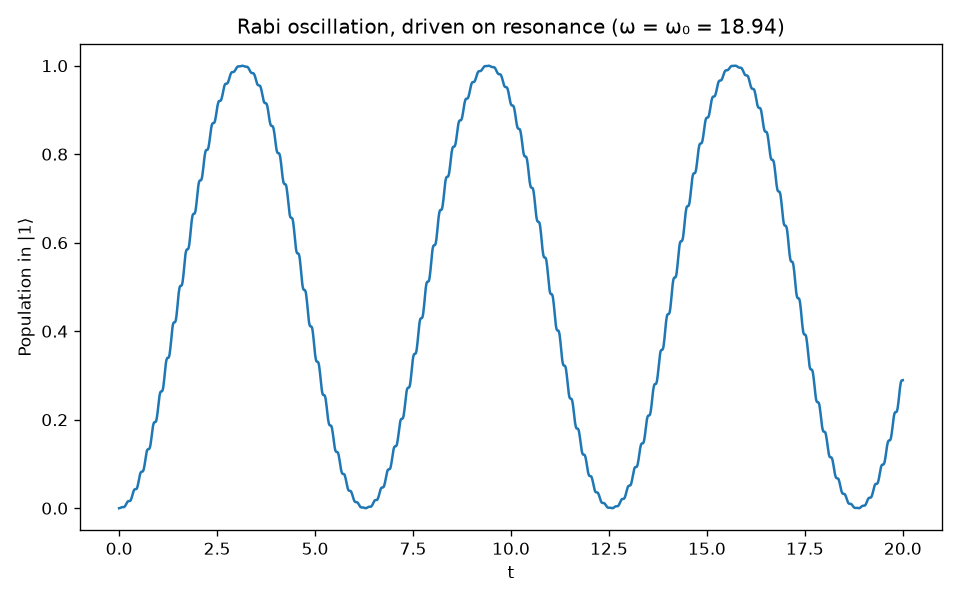

Sweeping the drive frequency across a range confirmed the qubit's response sharpens around $\omega_0$ as expected, a resonance curve.

We then compared this resonance curve's width to the transmon's anharmonicity, the frequency gap between the $0\to1$ and $1\to2$ transitions derived above. If the anharmonicity exceeds the resonance width, driving at $\omega_0$ avoids exciting the unwanted $1\to2$ transition. If not, leakage results, as discussed above, now arising from drive strength rather than insufficient anharmonicity alone. In practice, real devices mitigate this using specifically-shaped control pulses, such as DRAG pulses, designed to suppress unwanted population transfer to $|2\rangle$.

Our result: resonance curve width (FWHM) $\approx1.932$, transmon anharmonicity $1.148$, giving a ratio of $0.59$. Since this ratio is less than 1, the resonance curve is wider than the anharmonicity gap, meaning driving at this strength risks exciting the $1\to2$ transition as well. Avoiding this requires choosing a drive strength small enough to narrow the resonance width below the anharmonicity, at the cost of a slower gate, the speed-vs-selectivity tradeoff.

To investigate this further, we searched for a well-defined optimum: the fastest drive strength that still keeps the resonance width at or below the anharmonicity.

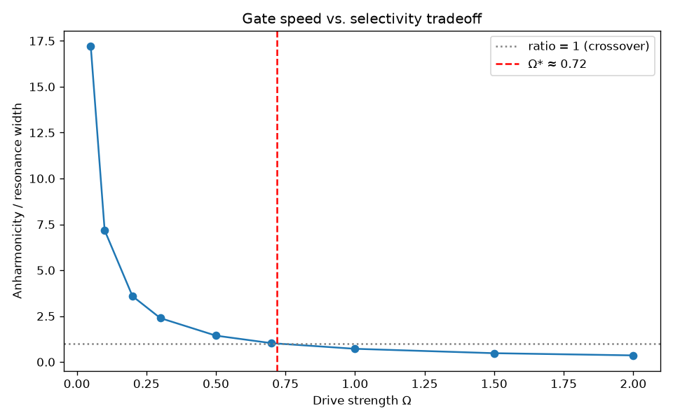

The crossover occurs at $\Omega^*\approx0.72$, giving a gate time of $\pi/\Omega^*\approx4.37$. This number, along with the anharmonicity it depends on, is compared against the qubit's coherence time in the next section, giving a complete, self-consistent picture of how many gate operations this qubit design could perform before decohering.

## Decoherence (T1 and T2)

So far in the project we have assumed a closed, isolated qubit, evolving purely unitarily with no loss or leakage into the environment. In this section, we remove that assumption to investigate what happens on real hardware.

A real qubit sits on a chip, surrounded by other circuitry and coupled to its surroundings. This coupling causes two distinct effects: $T_1$ (energy relaxation) and $T_2$ (dephasing). Energy relaxation is the qubit decaying from $|1\rangle$ to $|0\rangle$, and dephasing is the loss of the phase relationship between $|0\rangle$ and $|1\rangle$, without necessarily losing energy.

Once a qubit is coupled to an environment we are not tracking, it no longer has a well-defined state on its own, only the qubit and environment together do. We then describe the qubit using a $2\times2$ density matrix $\rho$, where $\rho_{11}$ gives the population in $|1\rangle$ (the same Born rule probability as before), and $\rho_{01}$ gives the coherence, the phase relationship between $|0\rangle$ and $|1\rangle$.

Energy relaxation itself also destroys coherence, if we do not know exactly when a decay from $|1\rangle$ to $|0\rangle$ happened, we have also lost the phase information that decay carried with it. This means $T_2$ is bounded by $T_1$:
$$\frac{1}{T_2}=\frac{1}{2T_1}+\frac{1}{T_2^*}$$
where $T_2^*$ is the additional, pure dephasing contribution on top of what $T_1$ decay itself causes.

The Lindblad master equation governs this evolution. We took a single qubit, starting in an equal superposition, and let it evolve under the Lindblad equation instead of a plain unitary circuit, tracking both the population remaining in $|1\rangle$, $\rho_{11}(t)$, and the coherence remaining, $|\rho_{01}(t)|$, to quantify how quickly "quantumness" disappears. For pure decay with no drive, the Lindblad equation predicts:
$$\rho_{11}(t)=\rho_{11}(0)e^{-t/T_1},\qquad|\rho_{01}(t)|=|\rho_{01}(0)|e^{-t/T_2}$$

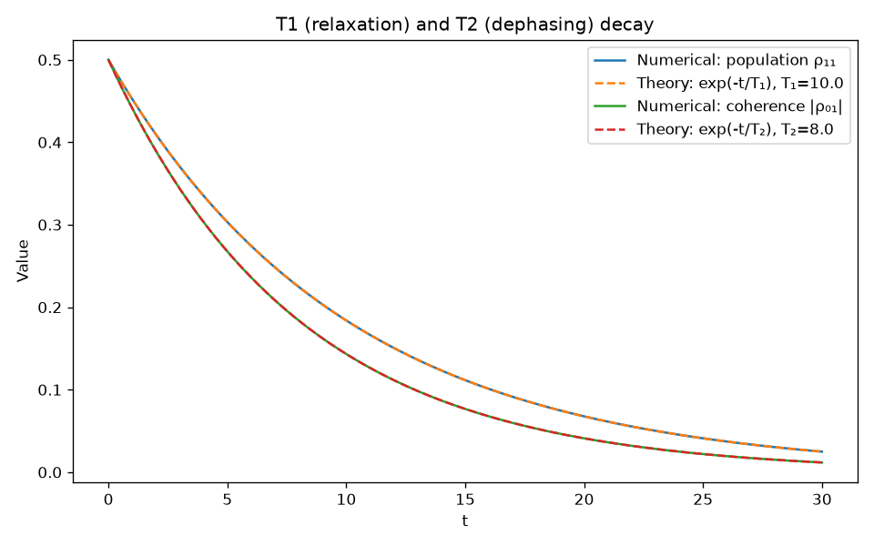

Our numerical solution matched both of these predictions essentially exactly, confirming the implementation is correct.

The $T_1=10$, $T_2=8$ values used here were chosen illustratively, in the project's natural units, purely to produce a clear, visible decay curve, not calibrated to any specific device. The decay physics here itself matches the Lindblad prediction, the specific numbers are not a measurement of anything real.

For real-world context, current superconducting qubits report coherence times of 50–300 microseconds, with record devices now exceeding 1 millisecond, against typical gate times of 10–50 nanoseconds. This gives real coherence-to-gate-time ratios of roughly 1,000–10,000+, the actual engineering margin that makes deep quantum circuits possible before decoherence dominates. This is why quantum error correction exists at all: even with this margin, a long enough computation will eventually be corrupted by decoherence unless errors are actively corrected.

Comparing this to our own numbers, if $T_1$ and $T_2$ are much larger than the Rabi gate time derived earlier ($\approx4.37$), a qubit survives comfortably many gate operations before decohering. If they are only comparable, the qubit sits at the edge of usability. This is the actual question real hardware design has to answer: how many gates can this system perform before it stops being quantum?

## Part 3 Summary

Part 3 set out to answer the question posed at the start of this project: where does the analogy between a classical solver and a quantum circuit hold, and where does it break?

It holds in the core mathematics: Trotterisation is the same operator-splitting idea as Part 1's split-step method, and it correctly reproduced entanglement growing dynamically between two qubits, something Part 1's single-particle physics could never show. It also holds in why this matters at all: classical storage grows exponentially with qubit number, while a Trotterised circuit's gate count grows only polynomially, the wall that motivates quantum simulation in the first place.

It breaks once real hardware is introduced. Strang splitting, mathematically better and the same choice Part 1 made, gave no real benefit as a circuit, since its extra gate cost outweighs the improvement on noisy hardware. Diagonalising the transmon's true potential, rather than Part 1's idealised harmonic oscillator, produced a real anharmonicity that both enables and limits qubit control, setting a genuine speed-versus-selectivity tradeoff. Decoherence sets the final limit: even a well-controlled qubit is only useful for as long as it stays coherent, a constraint with no analogue anywhere in Part 1's closed, idealised system.

# Discussion and Conclusion

Across all three parts, the analogy posed at the start of this project (that a classical solver and a quantum circuit can simulate the same system), held at the level of mathematical structure (Trotterisation and split-step evolution, bound states and transmon anharmonicity, a single Born rule in both continuous and discrete form), and broke in two distinct ways: entanglement, which is structurally absent from any single-particle system regardless of approximation, and the fact that mathematically identical techniques do not always behave identically once real hardware constraints are introduced, as seen when Strang splitting's theoretical advantage disappeared once judged against real gate cost.

Several limitations in this project are worth stating plainly. Trotterisation was not benchmarked against more advanced quantum simulation algorithms, nor against smarter classical methods which can outperform brute-force diagonalisation for certain structured systems. The comparison made in this project is specifically against brute-force classical diagonalisation. The two-qubit entanglement result demonstrates the phenomenon, but at a scale far too small to say anything about how it behaves in genuinely large systems. The $T_1$, $T_2$ values used in the decoherence section were illustrative, chosen in the project's natural units rather than calibrated to a real device, and the Rabi gate time was never converted into real physical units, so no direct, real-world gate-count figure was produced for this specific qubit design. Everything in this project ran on classical simulators; no result here was obtained on real quantum hardware.

Given more time, the most natural extensions would be converting the transmon and Rabi calculations into real physical units to allow a genuine comparison against published device parameters, testing the polynomial gate-scaling argument concretely for more than two qubits rather than analytically, and running the same circuits on real IBM hardware to see how simulator predictions compare against real device noise.

In summary, this project built a validated numerical solver for the time-dependent and time-independent Schrödinger equation across five scenarios, established the core formalism of discrete quantum information in Qiskit, and used Trotterisation as the concrete bridge between the two, extending into a first-principles derivation of transmon anharmonicity, driven qubit control, and decoherence.